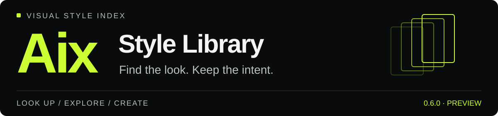
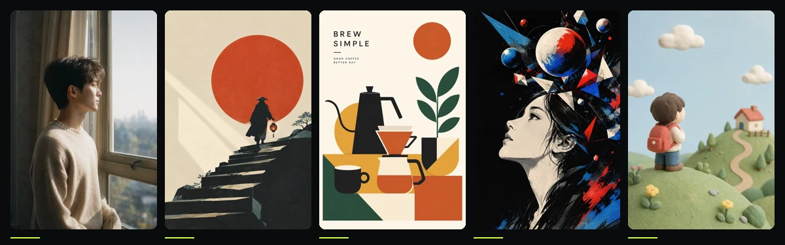
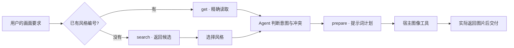

<div align="center">



# Aix 图片风格库

**把视觉灵感变成可查询、可复用、可验证的风格语言。**

按编号找到风格，按描述探索方向，把选中的视觉特征带进你的下一次创作。

**0.6.0 Preview** · **160 个风格** · **960 张样例** · **5 类视觉语言**

[开始使用](#quick-start) · [浏览风格](#gallery) · [样例证据](#examples) · [可靠性](#reliability) · [维护文档](#docs)

</div>



<p align="center"><sub>同一套调用方式，五种视觉语言。以上图片直接取自库内风格资源。</sub></p>

> **当前为预览版。** 0.6.0 已通过本地 78 项自动化测试、160 个风格的发布校验，以及打包后的解包冒烟；发布校验同时返回 `PREVIEW_ONLY`。这些结果验证数据与流程，不等同于正式 v1.0 的五门验收或“9 分质量”认证。详见 [本版验证记录](evaluation/results/0.6.0/reliability-report.md)。

<a id="overview"></a>
## 01 / 从「喜欢这张图」到「复用这种风格」

Aix 是一个面向创作者与 AI Agent 的结构化图片风格库。每种风格拥有稳定编号、视觉组件、代表缩略图、适用题材、已知弱项和评测记录。你可以查看库内缩略图与样例，也可以让 Agent 直接查询并合成提示词。

```text
使用 $aix-style-library 的 0002 风格，
画一只坐在窗边读书的小狐狸，竖版 9:16。
保留红色围巾，画面不要出现文字。
```

| 你想做什么 | Aix 提供什么 |
|---|---|
| 找回已经选过的风格 | `Aix0002` 等稳定 ID；支持简写 `0002`、`2`、`aix-0002` |
| 按想法探索视觉方向 | 基于名称、标签与描述等字段的本地检索，返回真实候选 |
| 将风格用于自己的画面 | 可组合的视觉组件；保留主体、动作、文字、画幅与明确约束 |
| 在图片之间看清风格差异 | 代表缩略图与人物、物体、场景三类样例 |
| 接入现有创作工作流 | 标准 JSON 请求与响应、可核验的版本和内容摘要 |
| 维护或分发风格包 | 索引一致性检查、路径校验、证据检查与不可覆盖的发布包 |

**Skill 负责选风格与准备提示词，实际出图交给宿主提供的图像工具。**`get`、`search`、`prepare` 不联网、不读取生成密钥，也不修改风格库。

<a id="gallery"></a>
## 02 / 风格图谱

| 视觉类别 | 数量 | 上方图谱中的风格 | 适合先探索的方向 |
|---|---:|---|---|
| `photographic` · 摄影 | 4 | [Aix0001 · 雾青胶片人像](skill/aix-style-library/styles/Aix0001/style.json) | 胶片、光线、摄影质感 |
| `illustration` · 插画 | 62 | [Aix0012 · 朱日禅意](skill/aix-style-library/styles/Aix0012/style.json) | 绘本、叙事、概念表达 |
| `graphic` · 平面 | 54 | [Aix0003 · 扁平几何海报](skill/aix-style-library/styles/Aix0003/style.json) | 海报、图形、视觉构成 |
| `painting` · 绘画 | 30 | [Aix0111 · 碎面星爆](skill/aix-style-library/styles/Aix0111/style.json) | 绘画肌理、抽象与超现实 |
| `3d` · 三维 | 10 | [Aix0006 · 黏土定格](skill/aix-style-library/styles/Aix0006/style.json) | 体积、材质、空间与造型 |

当前编号范围为 **Aix0001–Aix0160**。每个 active 风格都关联 **6 张样例：人物 × 2、物体 × 2、场景 × 2**。当前选用证据合计 960 张，历史重试和旧批次文件不重复计入这个数字。

<details>
<summary><strong>查看批次与数量来源</strong></summary>

| 当前风格范围 | 证据批次 | 风格数 | 样例数 |
|---|---|---:|---:|
| Aix0001–Aix0010 | 0.2.0 | 10 | 60 |
| Aix0011–Aix0020 | 0.3.0 | 10 | 60 |
| Aix0021–Aix0070 | 0.4.0 | 50 | 300 |
| Aix0071–Aix0110 | 0.5.0 | 40 | 240 |
| Aix0111–Aix0160 | 0.6.0 | 50 | 300 |
| **合计** | | **160** | **960** |

库版本读取自 [library.json](skill/aix-style-library/library.json)，风格集合来自 [catalog/index.json](skill/aix-style-library/catalog/index.json)，每个风格实际使用的证据由其 `quality.evidence_ref` 指向。

</details>

<a id="quick-start"></a>
## 03 / 开始使用

### 选择适合你的入口

| 入口 | 适合谁 | 需要什么 |
|---|---|---|
| 安装 Skill | 在支持 Skills 的 Agent 中调用 | Python 3.11+；生成图片还需宿主图像工具 |
| 直接运行 CLI | 查询数据、准备提示词、接入脚本 | Python 3.11+；运行命令仅依赖标准库 |
| 开发与发布校验 | 维护者 | Python 3.11+，`requirements-dev.txt` 中的依赖 |

### 安装 Skill

下载 [0.6.0 运行包](releases/aix-style-library-0.6.0.zip)，按照 [SHA-256 文件](releases/aix-style-library-0.6.0.zip.sha256) 校验后解压。把完整的 `aix-style-library/` 文件夹放到宿主实际使用的 Skills 目录，然后让宿主重新发现 Skill。

如果从源码安装，复制的是 `skill/aix-style-library/` 整个目录。不同宿主的安装位置和重新加载方式不同，应以当前宿主配置为准。

安装后可以这样说：

```text
查看 Aix0001 风格，告诉我它的视觉特点与适用题材。
```

```text
使用 $aix-style-library，帮我找 3 个适合儿童绘本的柔和水彩风格。
先推荐，不生成。
```

```text
使用 $aix-style-library 的 Aix0002，画一只坐在窗边读书的小狐狸。
竖版 9:16，保留红色围巾，不出现文字。请使用当前可用的图像工具生成。
```

`$aix-style-library` 是 Codex 中的显式调用写法；其他宿主使用其支持的 Skill 调用语法。

### 获取源码并完成第一次查询

```bash
git clone https://github.com/pixox24/aix-style-library-project.git
cd aix-style-library-project

python3 skill/aix-style-library/scripts/aix.py get --id 0001
```

成功响应中，`status` 为 `ok`，`code` 为 `OK`，`data.stage` 为 `resolved`。这里只是读取风格，还没有生成图片。

接着运行仓库中的现成请求：

```bash
# 按视觉描述检索
python3 skill/aix-style-library/scripts/aix.py search \
  --input tests/fixtures/requests/search-soft.json

# 保留红色咖啡机、白底和画中文字，准备提示词
python3 skill/aix-style-library/scripts/aix.py prepare \
  --input tests/fixtures/requests/prepare-coffee.json
```

示例咖啡机请求演示了视觉组件排除和画幅约分。成功输出的 `data.final_prompt` 可交给实际图像工具；`mode=generate` 本身不会发起生成。

> 本 README 的命令默认在仓库根目录执行。安装后调用脚本时，请使用实际 Skill 根目录下的绝对路径，不依赖当前工作目录。

<a id="workflow"></a>
## 04 / 从选择到生成，阶段始终清楚



| 阶段 | 含义 | 不能据此声称 |
|---|---|---|
| `resolved` | 已读取指定风格 | 图片已生成 |
| `candidates` | 搜索返回候选 | 用户已经选定其中一个 |
| `prepared` | 已完成提示词计划 | 已调用模型或已经拿到图片 |
| `generated` | 宿主实际返回图片资源后的交付状态 | 仅凭排队或提示词准备成功就完成出图 |

Agent 负责理解用户的自然语言、选择适合的候选、识别冲突。脚本负责编号归一化、请求校验、组件选择、固定顺序拼装和结构化响应。二者的分工见 [风格合成规则](skill/aix-style-library/references/composition.md)。

### 用户画面意图优先

风格应改变画面的视觉表达，而不是擅自替换用户的主体和场景。

| 情况 | 处理方式 |
|---|---|
| 用户指定红色产品，风格有强烈有色光 | 排除会干扰颜色的组件，保留产品要求并附调整说明 |
| 用户要求白底，例图是雨夜街道 | 不把例图中的街道自动搬进新画面 |
| 用户指定画面文字 | 通过 `text_literals` 逐字传递；实际生成效果仍取决于模型 |
| 用户指定构图或比例 | 保留要求；工具只能近似比例时明确说明 |
| 风格全部核心特征与请求冲突 | 返回 `STYLE_NOT_APPLICABLE`，不以空模板冒充该风格 |

### 三档强度

| 参数 | 选中范围 | 含义 |
|---|---|---|
| `light` | core | 只带入核心视觉特征 |
| `balanced` | core + support | 加入支持特征 |
| `strong` | core + support + accent | 加入点缀特征 |

强度控制模板中选取的组件范围，不是图像模型的 `stylize`、`denoise` 或 `guidance` 数值，也不保证视觉效果线性变化。随后还会应用明确记录的排除项。

<a id="protocol"></a>
## 05 / CLI 与结构化协议

| 命令 | 用途 | 写入行为 |
|---|---|---|
| `get --id <编号>` | 精确查询；可用 `--version` 要求特定风格版本 | 只读 |
| `search --input <JSON>` | 按视觉描述和分类检索 | 只读 |
| `prepare --input <JSON>` | 应用风格并生成提示词计划 | 只读 |
| `validate --scope all` | 结构、资源、路径与完整索引一致性检查 | 只读 |
| `validate --scope release --evidence-root evaluation` | 完整发布检查；可加 `--baseline` | 只读 |
| `build-index` | 从风格数据重建索引 | 更新索引，仅供维护者使用 |

<details>
<summary><strong>Search 请求：描述、关键词与分类</strong></summary>

把下面内容保存为 UTF-8 的 `search.json`，通过 `search --input search.json` 调用：

```json
{
  "api_version": "1.0",
  "operation": "search",
  "query": "适合儿童绘本的柔和水彩",
  "terms": ["儿童绘本", "柔和", "水彩"],
  "category": null,
  "limit": 3
}
```

`terms` 是 Agent 提炼的 1–8 个关键词，每项 1–40 字符；`limit` 允许 1–5，面向用户默认展示不超过 3 条。`category` 可留空或填写库内一级分类。无匹配时不凭空生成风格。

</details>

<details>
<summary><strong>Prepare 请求：保留内容，再应用风格</strong></summary>

把下面内容保存为 `prepare.json`，通过 `prepare --input prepare.json` 调用：

```json
{
  "api_version": "1.0",
  "operation": "prepare",
  "style_id": "0002",
  "style_version": null,
  "mode": "prompt",
  "target": "generic-text-v1",
  "strength": "balanced",
  "intent": {
    "description": "一只坐在窗边读书的小狐狸，戴着红色围巾，画面不要出现文字。",
    "aspect_ratio": "9:16",
    "text_literals": [],
    "must_preserve": ["红色围巾", "窗边读书的小狐狸"]
  },
  "resolution": {
    "exclude_features": [],
    "exclude_avoid": []
  }
}
```

- 请求文件大小上限为 **64 KiB**；完整字段约束见 [request.schema.json](skill/aix-style-library/references/schemas/request.schema.json)。
- `style_version=null` 使用当前安装包中的可用版本；指定不存在的版本会失败，不静默换版。
- 当前仅支持 `target=generic-text-v1`。
- 排除项必须属于该风格与当前强度可选组件，并记录原因；不能凭空构造组件 ID。
- 提示词按「画面内容 → 必须保留 → 逐字文字 → 视觉风格 → 画幅 → 避免出现」拼装。

</details>

<details>
<summary><strong>响应、错误与退出码</strong></summary>

所有命令向 stdout 输出一个 JSON 对象，含 `api_version`、`operation`、`status`、`code`、`message`、`data`、`warnings` 和 `meta`。失败时 `data=null`；默认不向 stdout 混入日志或堆栈。退出码可用于脚本和 CI 判定。

| 退出码 | 代表错误 | 建议动作 |
|---:|---|---|
| `0` | `OK` | 继续读取 `data`，同时处理警告 |
| `2` | `INVALID_REQUEST`、`INVALID_STYLE_ID` | 修正输入；缺少实质画面意图时再澄清 |
| `3` | `STYLE_NOT_FOUND`、`STYLE_NOT_ACTIVE`、`STYLE_DEPRECATED`、`STYLE_VERSION_UNAVAILABLE` | 说明真实状态，不静默替换编号或版本 |
| `4` | `STYLE_INVALID`、`ASSET_MISSING`、`PATH_OUTSIDE_LIBRARY`、`INDEX_STALE`、`RELEASE_NOT_READY` 等 | 停止相应流程，交由维护者修复 |
| `5` | `STYLE_NOT_APPLICABLE`、`TARGET_UNSUPPORTED` | 调整需求、风格或使用受支持目标 |
| `6` | `INTERNAL_ERROR` | 保留错误信息，停止无限重试 |

`STYLE_ADJUSTED`、`NEGATIVE_ADJUSTED` 表示为保留用户要求做了调整；`GENERATION_UNAVAILABLE` 表示没有可用的出图工具；`PREVIEW_ONLY` 表示只通过预览发布检查。**警告不能掩盖本应失败的输入。**

全部错误码、Agent 行为与降级规则见 [协议文档](skill/aix-style-library/references/protocol.md)；机器响应约束见 [response.schema.json](skill/aix-style-library/references/schemas/response.schema.json)。

</details>

<a id="examples"></a>
## 06 / 一种风格，三类主体


<p align="center"><sub>Aix0006 · 黏土定格 — 人物 / 物体 / 场景</sub></p>

每个风格都用不同主体检验其可迁移性。上图来自 Aix0006 的当前评测批次；保留相同的视觉语言，同时让主体与场景各自成立。样例用于帮助选择，不保证你的下一张图与示例一致。

| 人物 | 物体 | 场景 |
|---|---|---|
| [查看样例 01](evaluation/results/0.2.0/images/Aix0006-01.png) | [查看样例 03](evaluation/results/0.2.0/images/Aix0006-03.png) | [查看样例 05](evaluation/results/0.2.0/images/Aix0006-05.png) |
| [查看样例 02](evaluation/results/0.2.0/images/Aix0006-02.png) | [查看样例 04](evaluation/results/0.2.0/images/Aix0006-04.png) | [查看样例 06](evaluation/results/0.2.0/images/Aix0006-06.png) |

对应的 [风格定义](skill/aix-style-library/styles/Aix0006/style.json)、[六样例评测记录](evaluation/results/0.2.0/Aix0006.json) 与 [来源和权利说明](evaluation/rights/Aix0006.md) 可以一起核对。其他风格通过其 `quality.evidence_ref` 找到同类证据。

<details>
<summary><strong>如何阅读样例与评审记录？</strong></summary>

1. 先看 `description`、核心组件和缩略图，确认视觉方向。
2. 再比较人物、物体、场景的样例，观察风格在不同内容上的保留程度。
3. 检查 `weak_for` 和 `known_failures`，判断你的题材是否落在已知弱项中。
4. 核对证据中的风格版本、工具、日期与权利记录；历史样例不能替代当前工具的实际试用。

当前证据包含自动化评审。评分用于记录和筛查，不作为对外承诺的审美排名，也不能代替正式独立验收。

</details>

<a id="reliability"></a>
## 07 / 可靠性：让不合格输入真正停下来

校验贯穿输入、索引、资源、证据和发布，而不是仅在文档中约定格式。

| 检查层 | 实际检查 | 失败时的行为 |
|---|---|---|
| 输入与协议 | 请求结构、类型、大小、操作、编号与参数 | 返回约定错误 JSON 和非零退出码 |
| 索引 | 完整记录、版本、字段与摘要一致性 | 缺失或过期索引阻止检索，不自动修补 |
| 路径 | 资源的最终解析路径、目录边界与符号链接越界 | 阻止读取库或证据根目录外的目标 |
| 图片 | 文件存在、静态图片可解码、WebP 格式、尺寸与体积 | 缺失或损坏资源不能通过发布 |
| 评测证据 | 风格/版本/工具/日期一致，样例覆盖、评分和去重 | 不完整、不一致或重复样例被拒绝 |
| 版本兼容 | 对比旧包，检查已发布 ID、版本与同版本内容 | 阻止 ID 消失、版本倒退和同版内容改写 |
| 打包 | 固定运行资源清单、staging 校验、解包再校验与冒烟 | 校验失败不产生新发布包；禁止覆盖旧包 |

### 本版已验证

2026-10-01 在本地 macOS 环境完成：

- **78 / 78 自动化测试通过**，包含异常输入、路径逃逸、索引漂移、图片损坏、证据缺失与打包失败等回归用例。
- `validate --scope all` 通过：160 个 active 风格、160 个缩略图与完整索引一致。
- `validate --scope release` 通过：检查 960 个样例，返回 `release_profile=preview`、`formal_evidence_checked=false`。
- 以 0.5.0 运行包为基线完成 0.6.0 打包；ZIP 解包后的发布校验及 `get / search / prepare` 冒烟通过。

测试矩阵已配置为 Linux / macOS / Windows × Python 3.11 / 3.14，见 [GitHub Actions 配置](.github/workflows/verify.yml)。上面的记录是本地结果，不代替远程各平台运行结果。

### 预览版与正式版的界线

0.x.y 自动采用 `preview`；1.x.y 及以上自动采用 `formal`，不能用命令行参数降级绕过。正式版额外要求真实生成记录、图片 SHA-256 与提示词匹配，以及绑定当前库摘要的五项验收记录：Agent 行为、搜索、宿主工具、跨平台、回滚。

自动校验能确认格式、完整性和摘要关系，不能独立证明评分诚实、来源授权有效，或图片确由记录中的模型生成。视觉质量、真实工具行为和授权仍需复核。完整规则见 [发布校验规范](skill/aix-style-library/references/release.md)。

<a id="structure"></a>
## 08 / 仓库与数据结构

```text
aix-style-library-project/
├── README.md                         # 项目入口
├── PRD.md                            # 产品要求与正式验收规范
├── requirements-dev.txt               # 发布校验与图片检查依赖
├── assets/readme/                     # README 视觉资源与来源说明
├── skill/aix-style-library/           # 可独立安装的运行包
│   ├── SKILL.md                      # Agent 入口与行为约定
│   ├── library.json                  # 库版本、分类与元数据
│   ├── catalog/index.json            # 可验证的风格索引
│   ├── scripts/aix.py                # 确定性 CLI
│   ├── references/                   # 协议、合成、工具、发布与 Schema
│   └── styles/Aix0001/                # 每个编号一个目录
│       ├── style.json                # 结构化风格定义
│       └── thumbnail.webp            # 代表缩略图
├── evaluation/                       # 评测、生成与权利记录
├── tests/                            # 自动化测试与请求夹具
├── tools/                            # 打包、基准与维护脚本
└── releases/                         # 版本化运行 ZIP 与 SHA-256
```

**库版本与风格版本各自独立。** 例如库版本是 `0.6.0`，其中某个风格可为 `1.0.0`。不能仅凭一个风格的版本号把整库视为正式版。

<details>
<summary><strong>一个风格记录包含什么？</strong></summary>

| 字段组 | 内容 |
|---|---|
| 身份 | `id`、`version`、`status`、`schema_version` |
| 发现 | `name`、`description`、`category`、`tags`、`aliases` |
| 视觉 | `thumbnail`、`features`、`avoid` |
| 适配 | `suitable_for`、`weak_for`、`known_failures` |
| 来源 | `provenance`：来源引用、许可引用、使用范围等 |
| 质量 | `quality`：评审状态、工具、日期、证据引用 |
| 生命周期 | `replacement_id`：弃用后的登记替代项 |

视觉组件以 `medium / line / palette / lighting / texture / composition` 等轴描述，以 `core / support / accent` 分层。完整字段见 [style.schema.json](skill/aix-style-library/references/schemas/style.schema.json)。

状态包括 `draft`、`active`、`deprecated`。草稿不进入发布包；弃用记录保留以解释旧编号，替代编号必须指向包内 active 风格，不能在用户不知情时自动替换。

</details>

<a id="development"></a>
## 09 / 开发、发布与回滚

### 建立校验环境

```bash
python3 -m venv .venv
source .venv/bin/activate
python -m pip install -r requirements-dev.txt

python -m unittest discover -s tests -v
python skill/aix-style-library/scripts/aix.py validate --scope all
python skill/aix-style-library/scripts/aix.py validate \
  --scope release --evidence-root evaluation
```

Windows PowerShell 使用 `.venv\Scripts\Activate.ps1` 激活。完整发布校验依赖固定版本的 `jsonschema` 和 `Pillow`；缺失时返回 `DEPENDENCY_MISSING`，脚本不会擅自安装。

### 新增或修改风格

1. 分配未占用的 ID，先以 `draft` 编写 `style.json`；补齐视觉组件、弱项与失败案例。
2. 制作代表缩略图：静态 WebP，长边 640 px，短边至少 320 px，≤250 KiB；建议控制在 150 KiB 内。
3. 记录来源与权利；在实际图像工具上完成人物、物体、场景各至少 2 个样例，保存生成和评审证据。
4. 完成复核后设为 `active`。已发布风格内容变更需提升风格版本；发布实现变更也需提升库版本。
5. 重建索引，再运行完整测试与校验。

```bash
python skill/aix-style-library/scripts/aix.py build-index
python skill/aix-style-library/scripts/aix.py validate --scope all
```

`tools/generate_preview_assets.py` 只用于程序化演示夹具，会改写资产，不能代替真实出图与视觉评审。

### 构建发布包

把上一版本运行包解压到一个独立目录，使用其 `aix-style-library/` 作为基线：

```bash
python tools/build_release.py \
  --evidence-root evaluation \
  --baseline /path/to/previous/aix-style-library
```

首次发布可省略 `--baseline`。工具会在临时 staging 中按白名单复制运行资源、排除草稿、重建索引、执行发布检查；随后生成 ZIP、解包，再执行校验和三个运行命令的冒烟。全部通过才生成最终 ZIP 和 `.zip.sha256`。

**发布包不可覆盖。** 当前仓库已包含 0.6.0 产物，直接重复打包会被拒绝；下一次发布先按规范提升库版本。`--version` 必须与 `library.json` 相同，不能仅靠更改 ZIP 文件名伪装版本。

运行包包含 Skill 指令、协议、脚本、索引、active/deprecated 风格与缩略图。评测目录、内部参考原图、测试和开发日志不装入运行包。

### 移除与恢复

- **移除**：从宿主 Skills 目录移除完整的 `aix-style-library/`。
- **回滚**：校验旧包 SHA-256，备份当前安装后，以旧版本的完整目录替换，再让宿主重新发现 Skill。
- **核对**：运行 `get --id 0001`，检查响应中的库版本，并执行一次搜索与提示词准备。

不要把旧包直接合并覆盖到新包目录，也不要只替换某个 `style.json`；残留的风格、脚本或索引会破坏版本一致性。

<a id="limits"></a>
## 10 / 能力边界与常见问题

<details>
<summary><strong>安装以后就能自动出图吗？</strong></summary>

需要宿主实际提供并允许使用的图像工具。Skill 本身提供风格数据与提示词计划；没有出图工具时交付提示词并说明尚未生成。历史样例记录的工具身份为 `gpt-image-2 via change2pro OpenAI-compatible Images API`，这是现有证据中的记录，不是对所有宿主或模型的兼容保证。工具契约见 [host-tools.md](skill/aix-style-library/references/host-tools.md)。

</details>

<details>
<summary><strong>为什么相同风格在不同模型上效果不同？</strong></summary>

不同模型对媒介、光线、材质、文字和构图的响应不同。本库提供通用文本目标，不保证跨模型像素一致，也不把强度参数映射为所有模型都支持的数值。选用风格时应结合弱项与实际样例；重要交付需要在当前工具上复核。

</details>

<details>
<summary><strong>没有 Python，或 Agent 不能看图怎么办？</strong></summary>

文件仍可读取时，可按规范编号直接读 `style.json` 并进行人工降级，必须标记 `manual_fallback` 与 `UNVERIFIED_FALLBACK`，未计算的摘要为 `null`。不能看图时只能引用名称、描述和 alt，不能声称看过缩略图。资源缺失或无法读取时应明确失败，不能按编号猜内容。

</details>

<details>
<summary><strong>索引过期时，为什么不自动修复？</strong></summary>

查询应保持只读。`INDEX_MISSING` 或 `INDEX_STALE` 提示维护者检查数据并重建索引；指定编号的 `get` 可独立读取，但仍需通过该风格自身的校验。自动重建会把一次查询变成数据修改，还可能掩盖未审查的变更。

</details>

<details>
<summary><strong>只想使用 Skill，需要下载整个评测目录吗？</strong></summary>

不需要。直接下载本页提供的运行 ZIP 即可。完整源码仓库保留了大量生成样例和评测记录，适合开发、审查和维护；这些大体积证据不会装入 Skill 运行包。

</details>

<details>
<summary><strong>可以商用或再分发吗？</strong></summary>

请按对象分别查看许可。软件与协议、风格定义、缩略图和样例图片的许可边界不同；不能把代码许可自动套用到所有图像。图片以对应 `provenance` 与权利记录为准，内部收藏参考原图不随运行包分发，也不属于可再分发素材。详见下方授权说明。

</details>

<a id="docs"></a>
## 11 / 文档导航

| 文档 | 什么时候读 |
|---|---|
| [Skill 入口](skill/aix-style-library/SKILL.md) | 理解 Agent 如何选择、应用与交付风格 |
| [请求、响应与异常协议](skill/aix-style-library/references/protocol.md) | 接入 CLI、处理错误与降级 |
| [风格合成与冲突规则](skill/aix-style-library/references/composition.md) | 保留用户意图，处理文字、构图和风格冲突 |
| [宿主工具记录](skill/aix-style-library/references/host-tools.md) | 了解已记录工具能力与生成交接 |
| [发布与打包规范](skill/aix-style-library/references/release.md) | 准备证据、检查版本与制作运行包 |
| [0.6.0 验证记录](evaluation/results/0.6.0/reliability-report.md) | 查看本版自动检查结果及限制 |
| [产品规范 PRD](PRD.md) | 理解完整要求与正式验收标准 |
| [README 视觉来源](assets/readme/DESIGN.md) | 更新标题、画廊与样例图 |

<a id="license"></a>
## 12 / 贡献与授权

欢迎补充风格定义、失败案例、真实评测和协议修复。提交时请包含修改理由、涉及的风格 ID 与版本、可复现请求、对应证据以及验证结果；新增或修改风格遵循上方维护流程。不要提交密钥、私人配置或未经许可的参考原图。

| 对象 | 许可边界 |
|---|---|
| CLI 与协议描述 | MIT；保留对应版权与许可声明 |
| 风格组件与提示词数据 | CC BY 4.0；再分发时保留风格 ID、名称与来源说明 |
| 缩略图与评测图片 | 以各风格 `provenance` 和 [权利记录](evaluation/rights/) 为准 |
| 内部收藏参考原图 | 仅用于内部溯源，不装入运行包，不随新增提交分发 |

完整说明见 [LICENSE.md](skill/aix-style-library/LICENSE.md)；内部素材边界见 [sources/README.md](evaluation/sources/README.md)。已有声明不代替对具体使用场景的权利复核。

---

<p align="center"><strong>Find the look. Keep the intent.</strong><br /><sub>让风格服务于画面，让每次调用都有据可查。</sub></p>
